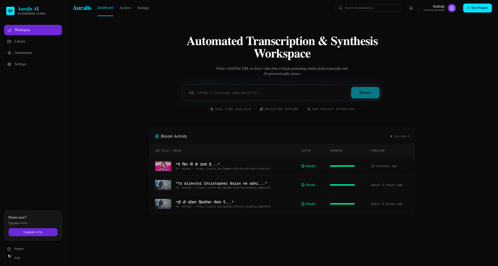
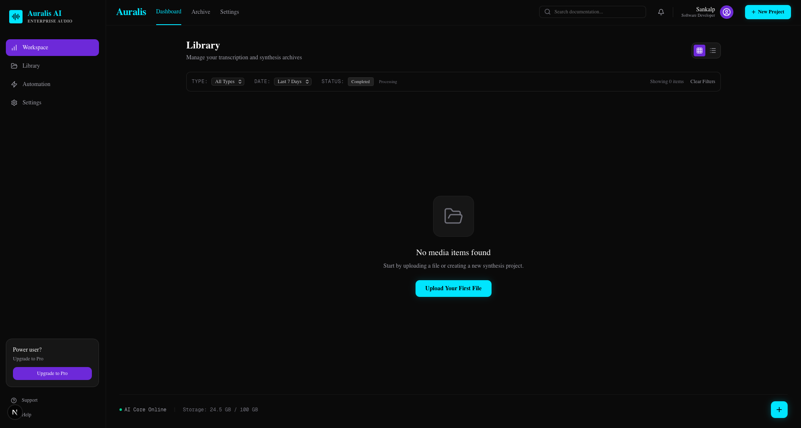
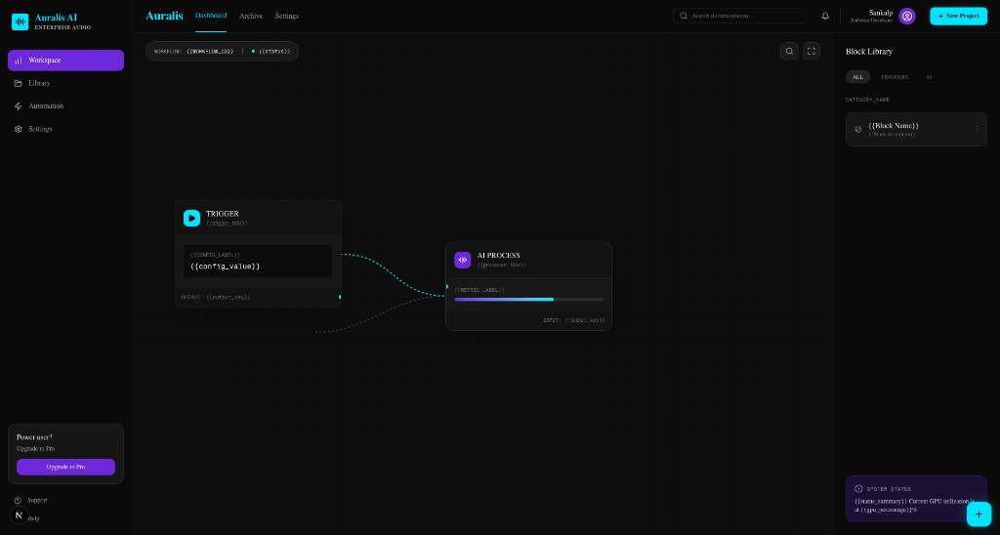
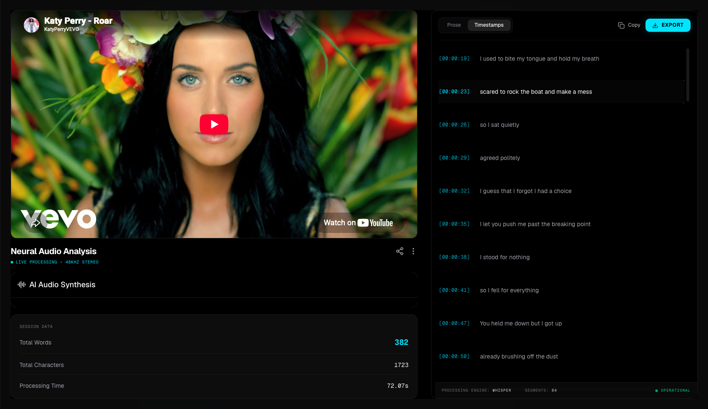
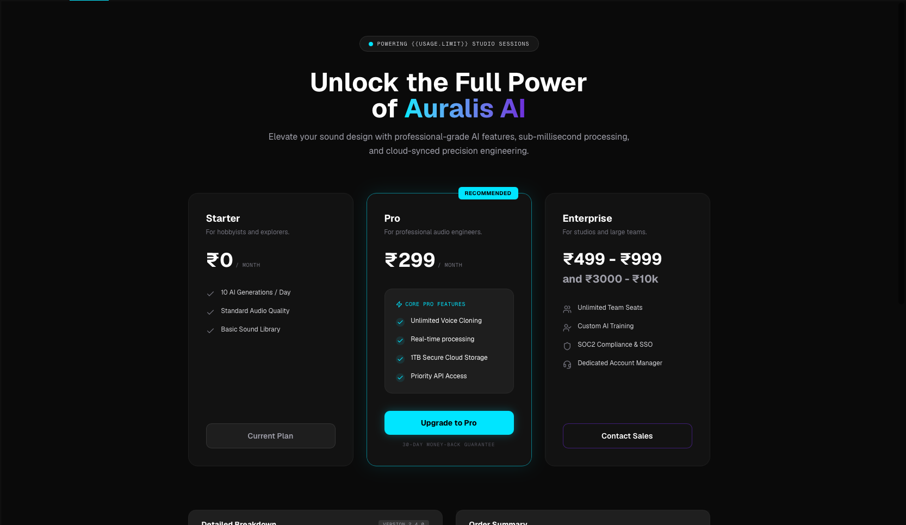
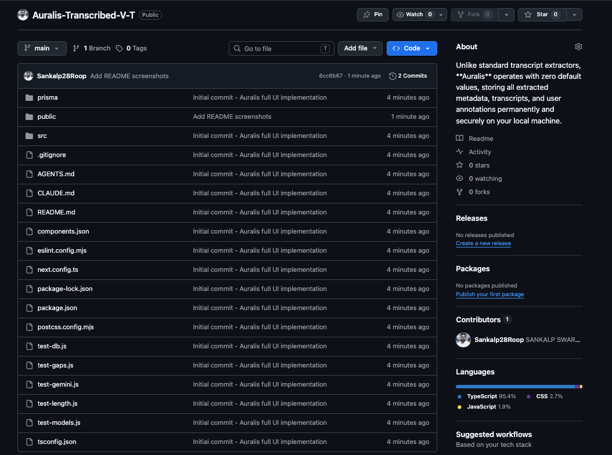

# Auralis AI

Elevate your sound design with professional-grade AI features, sub-millisecond processing, and cloud-synced precision engineering. Auralis is a powerful full-stack web application designed for automated video-to-transcript conversion and ultra-realistic AI audio synthesis.

## 📸 Screenshots

### 1. Dashboard


### 2. Library


### 3. Automation


### 4. Transcript


### 5. Upgrade Plan


### 6. Synchroglyph AI Engine


### 7. Payment Gateway (National and International)
.png)

## ✨ Features

- **Smart Video Extraction:** Seamlessly download and extract high-quality audio from YouTube videos using `yt-dlp` and `ffmpeg`.
- **Intelligent Transcription:** Generate highly accurate, timestamped transcripts from extracted audio using Google's cutting-edge Gemini Flash AI model.
- **Hyper-Realistic Voice Synthesis:** Clone voices and synthesize professional-grade speech audio from text using the ElevenLabs API.
- **Real-time Task Dashboard:** Monitor the status of your transcription and synthesis jobs with a sleek, responsive UI.
- **Beautiful Dark Mode UI:** Built with Next.js, Tailwind CSS v4, and Lucide React for a premium, studio-grade aesthetic.

## 🛠 Tech Stack

- **Frontend:** [Next.js 15](https://nextjs.org/) (App Router), [React 19](https://react.dev/), [Tailwind CSS v4](https://tailwindcss.com/)
- **UI Components:** [Lucide React](https://lucide.dev/) (Icons), [Shadcn UI](https://ui.shadcn.com/)
- **Backend:** Next.js API Routes, [Prisma ORM](https://www.prisma.io/), SQLite Database
- **AI Integrations:** Google Gemini SDK (`@google/genai`), ElevenLabs SDK (`elevenlabs`)
- **Media Processing:** `ffmpeg`, `yt-dlp`

## 🚀 Getting Started

### Prerequisites

Before you begin, ensure you have the following installed on your machine:
- [Node.js](https://nodejs.org/) (v18 or higher)
- [FFmpeg](https://ffmpeg.org/download.html) (Ensure it is added to your system PATH)
- [yt-dlp](https://github.com/yt-dlp/yt-dlp/wiki/Installation) (Required for YouTube extraction)

### Installation

1. **Clone the repository:**
   ```bash
   git clone <your-repository-url>
   cd Auralis
   ```

2. **Install dependencies:**
   ```bash
   npm install
   ```

3. **Set up Environment Variables:**
   Create a `.env` file in the root directory and add your API keys and database URL:
   ```env
   DATABASE_URL="file:./dev.db"
   GEMINI_API_KEY="your_google_gemini_api_key_here"
   ELEVENLABS_API_KEY="your_elevenlabs_api_key_here"
   ```

4. **Initialize the Database:**
   Push the Prisma schema to your SQLite database and generate the client:
   ```bash
   npx prisma generate
   npx prisma db push
   ```

5. **Start the Development Server:**
   ```bash
   npm run dev
   ```
   
   Open [http://localhost:3000](http://localhost:3000) in your browser to see the application.

## 📂 Project Structure

- `src/app/`: Next.js App Router pages (Dashboard, Settings, Archive, Upgrade, etc.)
- `src/app/api/`: Backend API routes for transcription and audio synthesis.
- `src/components/`: Reusable React components (Layouts, UI elements).
- `prisma/`: Database schema and SQLite database file.

## 📄 License

This project is licensed under the MIT License.
